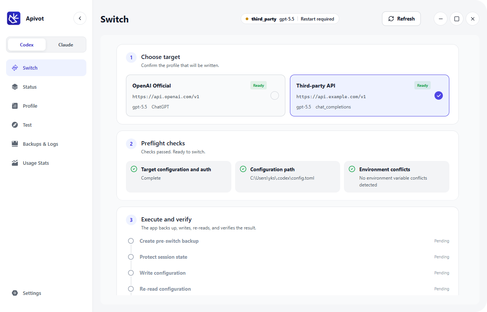
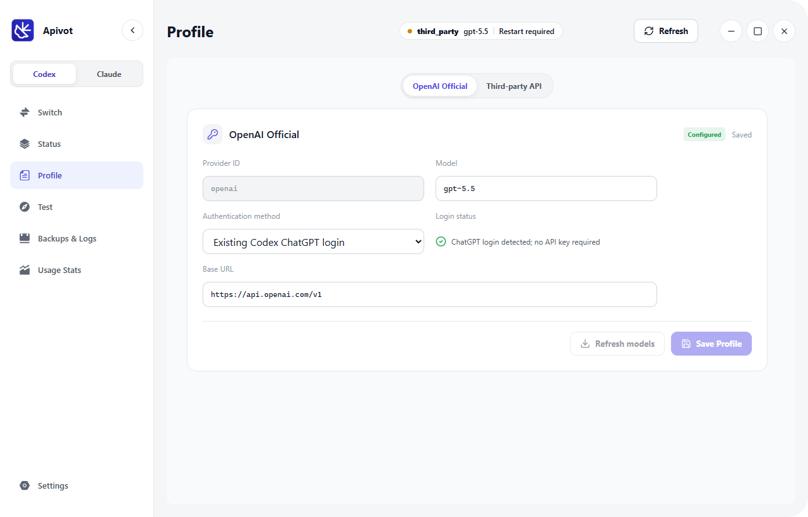

# Apivot

> 本地优先的 Codex 与 Claude Code 配置管理器。安全切换服务商，保护官方 API/登录环境，并在配置出问题时一键恢复。

[English README](README.md)

Apivot 是一个跨平台桌面工具，面向需要频繁切换 Codex、Claude Code、官方登录、第三方 API、本地适配器和配置备份的开发者。

它解决的核心痛点不是“能不能切换”，而是：你可以放心测试第三方服务商，同时保留官方环境的可恢复性，避免一次错误配置把官方 Codex 或 Claude Code 环境弄坏。

## 核心能力

- **一个窗口管理两个工具**：同时管理 Codex 和 Claude Code 的配置 Profile。
- **官方登录与 API 模式分离**：官方 OAuth 会话和第三方 API 服务商分槽管理，减少混淆。
- **保护官方环境**：第三方 API 切换不会盲目覆盖官方登录配置，降低官方环境被破坏的风险。
- **一键恢复官方配置**：当服务商、适配器或环境变量配置出错时，可以快速恢复到可用的官方环境。
- **本地适配器**：在本机转换接口格式，支持 Codex Responses 或 Claude 兼容路由。
- **安全切换**：切换前检查、自动备份、恢复预览和启动检测，降低配置写错的风险。
- **会话可视化**：对本地适配器可观测请求进行用量统计，并支持聊天记录分类浏览和选择性清理。
- **隐私优先**：无遥测、无云同步、不内置真实 API Key 或私有服务商地址。

## 功能亮点

| Profile 管理 | 安全与隐私 | 可视化 |
| --- | --- | --- |
| Codex 与 Claude Code Profile | 本地数据存储 | 用量统计 |
| 官方登录与第三方 API 模式 | 无遥测 / 无云同步 | 会话记录浏览 |
| 一键切换服务商 | 保护官方 API/登录环境 | 启动检测 |
| 本地适配器路由 | 切换前自动备份 | 恢复预览 |
| 官方环境一键恢复 | 前置配置检查 | 本地操作日志 |

## 屏幕截图

| 切换流程 | Profile 管理 |
| --- | --- |
|  |  |
|  |  |

## 安装

在 [Releases](https://github.com/Sotan-0714/Apivot/releases) 下载对应平台的版本：

| 平台 | 文件 | 说明 |
| --- | --- | --- |
| Windows 安装版 | `Apivot-Setup-1.0.1-x64.exe` | 推荐普通用户使用 |
| Windows 便携版 | `Apivot-Portable-1.0.1-x64.exe` | 无需安装 |
| macOS Apple Silicon | `Apivot-Setup-1.0.1-arm64.dmg` | M 系列芯片 |
| macOS Intel | `Apivot-Setup-1.0.1-x64.dmg` | Intel 芯片 |

可使用对应的 `.sha256.txt` 文件校验下载内容。

## 本地数据与隐私

Apivot 默认只在本机保存数据：

| 平台 | 默认数据位置 |
| --- | --- |
| Windows | `%APPDATA%\Apivot\` |
| macOS | `~/Library/Application Support/Apivot/` |

这些数据可能包括 API Key、Base URL、Profile 设置、用量日志、备份和会话快照。它们不会被程序上传，也已通过 `.gitignore` 排除在版本控制之外。

Apivot 不会盲目覆盖官方配置。执行高风险切换前，程序会创建备份、进行兼容性检查，并提供恢复路径，帮助你回到可用的官方环境。

用量统计仅来自 Apivot 可观测的请求，例如本地适配器流量，以及返回 `usage` 的连接测试；它不等同于官方服务商账单。

## 从源码运行

```bash
npm install
npm start
```

构建发布包：

```bash
npm run dist:win
npm run dist:mac
```

macOS 安装包需要在 macOS 机器或 GitHub Actions macOS runner 上构建。

## 许可证

Apivot 使用 [MIT License](LICENSE) 开源。
